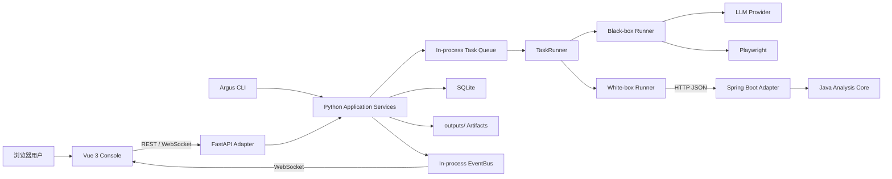

# Argus 架构基线与演进约束

> 本文是 Argus 的架构事实来源（Architecture Source of Truth）。所有新增功能、
> 重构、依赖升级和部署调整都必须遵守本文；如确需改变基线，必须在同一次变更中先更新
> 本文并说明迁移、兼容和回滚方案。

## 1. 文档约定

本文同时描述当前基线和目标约束：

- **必须（MUST）**：不可绕过的正确性、安全或一致性要求。
- **应该（SHOULD）**：默认选择；偏离时必须给出可验证理由。
- **可以（MAY）**：在不破坏上层约束时可自行选择。
- 标记为“演进目标”的内容允许旧代码暂未满足，但所有新增代码必须朝该方向收敛，
  不得扩大既有债务。

架构优化以可维护性、契约稳定性、可观测性和可验证性为优先级，不以模块数量、设计模式
数量或框架新旧作为目标。

## 2. 系统定位与边界

Argus 是单仓库、可私有部署的 AI 测试平台：

- **黑盒测试**：Python 编排 LLM 与 Playwright，对 Web 应用执行、评估并生成证据。
- **白盒分析**：Python 管理任务，Java Analyzer 使用 JavaParser 和 Maven classpath 分析
  Java 源码。
- **管理控制台**：Vue SPA 通过 FastAPI REST API 与 WebSocket 管理项目、任务、模型、
  报告和调试数据。



### 2.1 系统责任边界

- Python 是控制面和任务事实来源：任务生命周期、调度、项目/模型配置、报告和审计均由
  Python 管理。
- Java Analyzer 是无 UI 的分析计算服务：接收显式分析请求并返回结构化结果，不拥有
  Python 的任务数据库或业务状态。
- 前端只通过公开 API/事件契约访问系统，不读取数据库、`outputs/` 或 Java Analyzer。
- Python 与 Java 之间只通过版本可演进的 HTTP/JSON 契约通信，不共享进程内对象或数据库。

## 3. 稳定技术决策

| 领域 | 当前基线 | 约束 |
|------|----------|------|
| 前端 | Vue 3、TypeScript、Vite、Element Plus | 不并存第二套 UI 框架或状态方案，除非现有方案已被数据证明无法满足需求 |
| 控制面 | Python 3.11+、FastAPI、Pydantic、Uvicorn | FastAPI 仅是接口适配层；业务能力不得依赖路由上下文 |
| Python 环境 | uv、`pyproject.toml`、`uv.lock`、项目 `.venv` | 依赖变更必须更新锁文件；运行脚本不得隐式升级依赖 |
| 黑盒执行 | Playwright、可替换 LLM provider | 浏览器和 LLM 都是外部能力适配器，失败必须可超时、可取消、可追踪 |
| Java 分析 | Java 21、Spring Boot、JavaParser | Spring Boot 负责 HTTP、配置和生命周期；核心分析逐步保持纯 Java |
| 持久化 | SQLite WAL、文件产物 | Schema 只通过增量迁移演进；文件只通过统一路径组件访问 |
| 实时通信 | 进程内 EventBus、WebSocket | 当前只支持单 Python 进程/单副本 |
| 部署 | Docker Compose、单副本 | 前端生产构建由 FastAPI 托管；Java Analyzer 可独立启停 |

引入新框架、数据库、消息中间件、DI 容器或独立服务前，必须先证明现有基线存在可量化的
瓶颈，说明迁移成本和退出策略。仅以“更轻”“更现代”或“以后可能需要”为理由不成立。

## 4. 分层与依赖方向

### 4.1 通用规则

所有子系统遵循从外向内的依赖方向：

```text
接口/展示适配层 → 应用编排层 → 领域能力与端口
                         ↑
                 基础设施适配实现
```

- 外层可以依赖内层；内层不得反向依赖 FastAPI、Vue、Spring MVC、SQLite 或具体 HTTP
  客户端。
- 组合和具体实现选择只发生在组合根：Python 为 `argus_py/runtime/container.py`，Java
  为 Spring `config`/应用启动配置，前端为 `main.ts` 与顶层 composable。
- API/CLI/UI 不得自行构造存储、Runner、HTTP 客户端或线程池。
- 跨模块调用必须经过公开 service、port 或显式 handler，不得调用其他模块的私有函数或
  绕过状态机直接修改数据。
- 为修复旧代码而临时偏离时，必须限制影响范围、补测试并记录后续收敛点。

### 4.2 Python 分层

Python 包按职责理解，不要求为追求形式立即重排目录：

| 层 | 主要位置 | 职责 |
|----|----------|------|
| 接口适配 | `argus_py/api/`、`argus_py/cli/` | 参数解析、认证、协议转换、错误映射和调用应用服务 |
| 应用编排 | `argus_py/task/application.py`、`argus_py/execution/` | 用例编排、任务 handler 分派、超时和生命周期协调 |
| 领域能力 | `task/`、`project/`、`blackbox/`、`whitebox/`、`report/` | 业务规则、状态转换和测试/分析能力 |
| 基础设施 | `infra/`、`browser/`、`llm/`、`observability/` | DB、队列、事件、外部 HTTP、浏览器、日志和文件适配 |
| 组合根 | `runtime/container.py` | 创建共享实例、注入依赖、统一关闭资源 |

硬约束：

- FastAPI route 必须保持薄：完成 schema 校验和协议映射后调用应用服务；不得在 route 中
  编写任务流程、SQL、文件遍历或外部服务重试。
- CLI 与 API 必须复用同一应用服务和领域规则，不维护两份业务实现。
- 任务状态只能通过 `TaskLifecycleService` 等生命周期边界改变，禁止直接写 `status` 或绕过
  合法状态转换。
- 阻塞的 DB、文件、Git 和报告操作必须通过统一 IO executor/`run_in_thread` 执行，不能
  阻塞事件循环。
- 共享资源必须由 `RuntimeContainer` 创建和关闭；测试必须清理缓存单例，避免跨事件循环或
  跨用例污染。
- 新任务类型通过 `TaskType`、独立 handler/runner 和 `TaskRunner` 注册扩展，不在 Runner
  主流程中堆叠任务类型分支。

演进目标：`TaskRunner` 的默认 handler 及其存储依赖应由组合根装配，Runner 自身不再创建
`TaskSQLiteStorage` 等具体基础设施。

### 4.3 前端分层

| 层 | 主要位置 | 职责 |
|----|----------|------|
| View | `frontend/src/views/` | 页面布局、路由级状态和用户流程 |
| Component | `frontend/src/components/` | 可复用展示与局部交互 |
| Composable | `frontend/src/composables/` | 页面用例、异步状态和组合逻辑 |
| API adapter | `frontend/src/api/`、`ws.ts` | REST/Blob/WebSocket 传输、认证、超时和错误标准化 |

硬约束：

- View/Component 不得散落裸 `fetch`、Token 拼接或 API base URL；统一经 API adapter。
- 跨页面业务状态和异步流程优先放入 composable；组件保持输入/输出明确，不依赖隐式全局
  可变状态。
- 当前不引入 Vue Router 或 Pinia；只有导航/状态关系经测量和代码审查确认已超出 composable
  与现有组合根的可维护范围时才评估，并且迁移后只能保留一个事实来源。
- `openapi.gen.ts` 是生成物，禁止手工修改。后端 schema 变更后必须重新生成并通过
  `codegen:check`。
- UI 必须依据稳定错误码处理分支，不解析后端错误文案。
- WebSocket 重连必须有退避和取消机制；历史补偿以服务端事件查询为准，不假设实时连接
  永不丢失。
- 开发态由 Vite 代理 `/argus/api`、`/health` 和 WebSocket；生产态静态资源由 FastAPI
  同源托管。反向代理必须保留 API 路径和 WebSocket Upgrade 语义。

### 4.4 Java Analyzer 分层

当前 Spring Boot 继续保留，但职责限定如下：

| 层 | 主要位置 | 职责 |
|----|----------|------|
| Spring adapter | `api/`、`config/`、启动类 | HTTP、校验、配置绑定、Bean 装配、健康检查和生命周期 |
| 应用编排 | `service/` 中的作业与分析编排 | 作业状态、缓存、并发调度、进度事件和分析步骤组合 |
| 分析核心 | `service/`、`env/`、`support/` 中的算法能力 | 扫描、classpath、解析、调用图、规则、流程和聚类 |

目标逻辑边界如下。先在当前 Maven 模块内通过包与依赖测试落实；只有边界稳定并出现独立构建
需求时才拆 Maven 子模块，禁止直接拆成更多微服务：

```text
boot / Spring configuration
            │
HTTP adapter ──→ application ──→ domain
                         ↑
        JavaParser engine / Maven / cache / job adapters
```

- `domain`：纯 Java 的分析能力、结果、诊断和扩展点；不依赖 Spring、JavaParser、HTTP、
  文件系统或 Maven。
- `application`：分析用例、作业编排、进度事件和端口接口；只依赖 domain。
- `engine.javaparser`：源码索引和分析 pass；可依赖 JavaParser，不依赖 Spring/HTTP DTO。
- `infrastructure`：源码、Maven/classpath、缓存、JobStore 和外部进程 adapter。
- `adapter.http`：Controller、Validation、传输 DTO、异常映射和 command/result 转换。
- `boot`：Spring Boot 入口、Bean 装配、配置绑定、调度和线程池。

新代码必须遵守：

- 分析算法、领域模型和扩展接口不得依赖 Spring MVC、`ApplicationContext` 或 HTTP DTO。
- Controller 只做输入/输出映射；不能直接执行扫描、Maven 命令或分析算法。
- Spring 注解只能出现在 adapter、配置和必要的应用装配边界。核心对象优先构造器注入的纯
  Java 类，以便无需 Spring 上下文即可单元测试。
- 新的分析能力必须实现独立、可测试的分析单元，声明输入、输出和适用 scope；不得继续向
  `ProjectAnalyzerService` 增加大段条件分支。
- 当新增第二类可插拔分析步骤时，提取稳定的 `AnalysisPass` SPI，由应用编排层接收
  `List<AnalysisPass>` 并按显式顺序/依赖执行；SPI 不暴露 Spring 类型。
- `AnalysisPass` 至少声明稳定 ID、所需/产出能力、支持的分析计划，以及接收
  `AnalysisContext` 后返回不可变 contribution。能力依赖必须构成无环图，启动时校验重复、
  缺失和循环依赖；无依赖 pass 才能并行。
- Pass 默认按单例使用，必须无状态且线程安全；请求状态只存在于 context/局部变量，不得
  修改共享 AST、其他 pass 结果或最终 HTTP DTO。必需 pass 失败使作业失败，可选 pass
  失败必须进入 diagnostics，禁止静默吞错。
- HTTP `scope` 只作为兼容输入，在 adapter 映射为类型化 `AnalysisPlan/Capability`；新增核心
  代码不得继续比较 `"all"`、`"flows"` 等字符串。
- 一次分析只构建一次规范化项目快照/源码索引并供 pass 复用。缓存键必须包含源码、
  classpath/config、分析器版本与 pass 版本指纹，不缓存可变 AST。
- Maven/classpath 属于外部工具适配，命令执行、超时和异常转换停留在 gateway 边界；上层
  不解析 stdout/stderr 文本判断业务状态。
- Spring Boot 替换只能由实际启动时间、空闲内存、镜像体积或短生命周期执行需求触发；
  替换前必须证明收益覆盖 HTTP、校验、调度、健康检查和运维能力的重建成本。
- Domain、application 和 pass 单元测试必须可以脱离 Spring Context 直接实例化；边界稳定后
  增加包依赖架构测试，阻止核心重新引入 Spring/adapter 类型。

## 5. 契约与跨服务通信

### 5.1 浏览器与 Python API

- `/argus/api` 下的 OpenAPI schema 是 REST 类型契约的事实来源。
- 公共字段优先做向后兼容的新增；删除、改名、收紧校验或改变语义必须提供迁移窗口。
- 错误响应保持稳定的 `code`、`message`、`details` 结构；程序逻辑依赖 `code`，`message`
  面向用户。
- API 变更必须同步 Pydantic schema、前端生成类型/API adapter 和契约测试。
- Blob、报告、截图等受保护资源必须继续经过认证请求，不把 Token 写入长期 URL。

### 5.2 Python 与 Java Analyzer

- Java DTO 与 `argus_py/whitebox/models.py` 是同一 wire contract 的两端，必须同步演进。
- 变更请求/响应时必须同时更新 Java DTO/Controller、Python client/model、序列化契约测试和
  兼容说明。
- 跨服务字段采用明确、稳定的 JSON 名称；不得依赖 Java/Python 类名或默认序列化偶然行为。
- 网络调用必须有连接/请求超时、有界重试和可诊断错误；非幂等请求不得盲目重试。
- `WhiteboxClient` 必须继续显式创建并传入 `httpx.AsyncHTTPTransport`；这是当前
  httpx/Tomcat 11 通信兼容基线，除非有回归测试证明可以移除。
- 服务地址必须通过配置或组合根注入。`localhost:8081` 只可作为本机默认值，容器部署必须
  使用服务 DNS，不得把部署拓扑硬编码进领域代码。
- `sourcePath` 必须在 Java 进程可见并指向同一内容。容器模式必须使用显式共享卷或由 Java
  自己获取源码，不能假设宿主机路径自动可见。
- 两个服务不得共享或直接修改对方数据库；跨服务一致性通过任务状态和幂等 API 管理。

### 5.3 实时事件

- 任务最终状态以持久化存储为准，WebSocket 是低延迟通知渠道，不是唯一事实来源。
- 进程内 `EventBus` 用于实时发布和有限历史回放，重启即丢失；需要重启后查询的事实必须
  进入 SQLite。
- `TaskTimelineService` 是面向用户的持久化时间线，但采用缓冲写入；阶段结束、任务终态和
  异常退出路径必须主动 flush，不能把未落盘缓冲当作可靠事实。
- 事件必须携带稳定事件类型、任务标识、时间和必要上下文；新增字段保持向后兼容。
- 前端断线重连后通过查询接口恢复状态，不能要求 EventBus 无限保留历史。

## 6. 状态、并发与扩展边界

### 6.1 单进程硬约束

当前 Python `TaskQueue`、EventBus、依赖容器和部分限流状态均在进程内，因此：

- Uvicorn worker 必须为 1，Python 服务副本必须为 1。
- 业务并发只通过 `scheduler.concurrency`、有界线程池和有界外部调用并发调整。
- 不得删除现有多 worker 防护或通过其他启动命令绕过。

只有同时完成以下改造，才允许多 worker/多副本：

1. 队列迁移到具备消费确认、重试和租约的外部系统；
2. EventBus 迁移到跨进程 pub/sub，并定义断线补偿；
3. 任务执行具备幂等键、抢占/续租和重复消费保护；
4. SQLite 与本地文件迁移为多副本可安全访问的存储；
5. 认证、限流和缓存状态不再依赖单进程内存；
6. 增加多副本故障和一致性测试后再解除部署护栏。

### 6.2 数据与迁移

- 进程内队列的顺序和取消信号不是持久化事实；服务重启只恢复被中断任务状态，不得静默
  重新排列或自动重复执行 pending 任务。
- 报告必须在任务完成事件发布前生成并保存，确保终态事件携带可访问的报告路径。
- SQLite schema 只能通过 `argus_py/infra/migrations/sql/` 的连续版本迁移演进。
- 已发布迁移不得修改、重排或复用版本号；破坏性变更必须有备份、双读/双写或数据转换方案。
- 所有缓存和内存作业表必须有容量上限、TTL/淘汰策略及并发安全定义。
- 缓存键必须覆盖影响结果的输入；源码分析缓存必须包含内容指纹，不能只依赖路径。
- 运行时产物统一位于 `outputs/`，路径解析必须防止目录穿越，不把运行时数据提交到仓库。
- Java 异步 JobStore 和结果缓存当前也在 JVM 内存中；使用异步 Job API 时 Java Analyzer
  保持单实例。只有 JobStore/队列共享化并具备幂等协调后才允许横向扩展。

## 7. 配置、安全与隐私

- 配置从现有 settings/config 边界读取，业务模块不得散落读取环境变量或硬编码端口、目录、
  URL 和并发数。
- API Key、Token、Cookie 和 Fernet key 不得写入源码、普通配置样例、URL、异常文案或未
  脱敏日志。
- 模型配置和外部 URL 必须保留 SSRF 校验；新增网络出口必须复用或扩展统一 URL 安全策略。
- 外部输入的路径、仓库 URL、文件名和命令参数必须在 adapter/gateway 边界验证；禁止通过
  shell 字符串拼接执行用户输入。
- 安全限制只能在有替代控制、测试和迁移说明时放宽，不得为绕过本地调试问题直接关闭。

## 8. 可观测性与可靠性

- Python 日志遵守 [`logging.md`](logging.md)：模块 logger、结构化字段、request/task context、
  审计与访问日志分流保持一致。
- 服务层不得用 `print` 代替日志；CLI 面向用户的输出继续使用独立 `cli_*` 通道。
- 跨线程工作通过统一 context 传播工具执行，确保 request/task ID 不丢失。
- 新增长任务或外部调用必须定义：超时、取消、重试条件、并发上限、资源清理和错误归类。
- 捕获异常时必须保留根因；只在协议边界转换为稳定错误码/HTTP 状态。
- 健康检查只验证服务能否接收请求；依赖就绪状态如需暴露，应单独定义 readiness，不在健康
  接口执行昂贵分析。

## 9. 扩展方式

| 新能力 | 正确扩展点 | 必须同步的内容 |
|--------|------------|----------------|
| 新任务类型 | `TaskType` + 独立 runner/handler + 组合根注册 | 生命周期、输入 schema、报告、API/前端和测试 |
| 新 LLM 提供商 | LLM provider/client 适配边界 | 配置校验、脱敏、超时重试和契约测试 |
| 新浏览器动作 | browser action/执行器边界 | 参数模型、Planner 协议、证据和失败恢复测试 |
| 新 Java 分析规则 | 独立分析单元，后续统一到 `AnalysisPass` SPI | scope、诊断、结果 DTO 和纯 Java 单测 |
| 新 API | 薄 route + 应用服务 | OpenAPI、前端类型、错误码、认证/限流和契约测试 |
| 新存储实现 | 领域端口的基础设施 adapter | 迁移、一致性、关闭生命周期和集成测试 |

禁止用复制现有流程、在入口添加大型 `if/else`、全局可变注册表或跨层直接引用的方式扩展。

## 10. 开发、测试与发布门禁

每次变更按影响范围选择最低充分验证：

- Python：Ruff、格式检查、Mypy，以及对应 unit/integration 测试。
- 前端：ESLint、Vue/TypeScript 类型检查、Vitest；涉及构建时执行 Vite build。
- REST schema：重新生成 OpenAPI TypeScript 类型并确保 `codegen:check` 无差异。
- Java Analyzer：对应纯单元测试和 API/序列化测试，CI 以 `mvn verify` 为门禁。
- 跨服务：至少覆盖成功、超时、服务不可达、非 2xx、响应不兼容和取消场景。
- 数据变更：迁移空库、已有库、重复启动和失败回滚场景。
- 部署链路：涉及 Docker、依赖或静态资源时验证相应镜像构建和健康检查。

本地自动化代理是否可以运行 Maven，以根目录 `CLAUDE.md`/`AGENTS.md` 的命令安全规则为准；
不得用“未在本地执行”替代 CI 应有的验证门禁。

## 11. 架构变更流程

实现前必须回答：

1. 变更属于哪个层，依赖方向是否正确？
2. 是否改变 REST、WebSocket、Python↔Java、数据库或文件格式契约？
3. 是否引入新的状态、并发、后台任务或失败模式？
4. 是否有更小的现有扩展点可复用？
5. 如何观测、验证、迁移和回滚？

以下变更必须在 `docs/adr/` 新增简短 ADR，并在同一变更中更新本文：

- 替换主要框架、数据库、队列、事件系统或 API 协议；
- 新增可独立部署服务或拆分现有服务；
- 解除单进程/单副本约束；
- 引入会改变任务一致性、安全边界或数据所有权的机制。

ADR 至少包含：背景、决策、备选方案、取舍、兼容/迁移、回滚和验证指标。

## 12. 当前演进优先级

后续架构优化按以下顺序推进：

1. **守住现有契约和单副本正确性**：不以扩展性名义提前削弱状态、鉴权和事件约束。
2. **收敛组合根**：把 Runner 内部创建具体存储/客户端的逻辑迁回 RuntimeContainer。
3. **隔离 Java 核心**：逐步让分析算法脱离 Spring/HTTP DTO，并在新增分析类别时建立
   `AnalysisPass` SPI。
4. **强化 Python↔Java 契约**：服务地址配置化、DTO 兼容测试、容器源码可见性明确化。
5. **按测量结果扩容**：只有单进程吞吐成为真实瓶颈后，才外置队列、事件和存储。

任何“优化”如果跳过前置边界、缺少测量或使测试与故障恢复更困难，默认不接受。

## 13. 关联规范

- 日志、审计、上下文字段和脱敏：[`logging.md`](logging.md)
- 私网部署、单副本、安全与迁移：[`deployment.zh.md`](deployment.zh.md)
- 已识别的历史优化项：[`optimizations/follow-up-optimizations.md`](optimizations/follow-up-optimizations.md)
